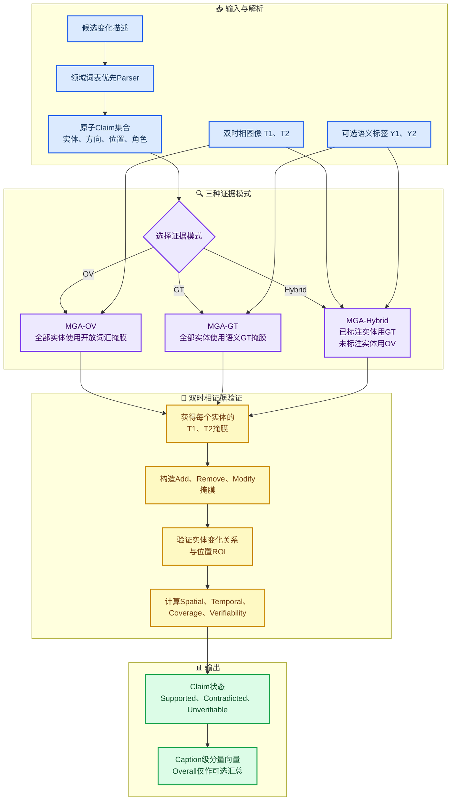
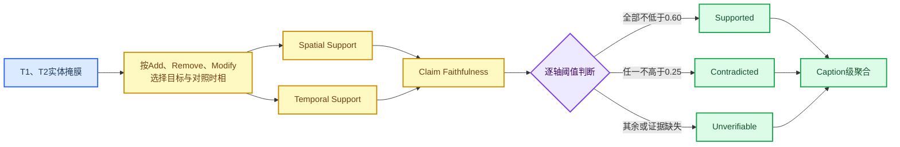

# MGA三模式计算流程与公式

_MGA-GT、MGA-OV与MGA-Hybrid统一计算说明，依据当前代码实现与论文建议定义整理，2026-07-27。_

---

## 📋 总体流程

三种模式共享同一个Parser、Claim表示、时相差分、空间关系验证和Caption级聚合模块，只改变实体掩膜与变化ROI的证据来源。



论文图的可编辑Draw.io源文件及导出版本位于：

- `paper/figures/mga_three_mode_flow_clean.drawio`
- `paper/figures/mga_three_mode_flow_clean.svg`
- `paper/figures/mga_three_mode_flow_clean.png`

## 📚 符号定义

| 符号 | 含义 |
|---|---|
| \(I_1,I_2\) | T1、T2双时相遥感图像 |
| \(Y_1,Y_2\) | T1、T2语义类别GT |
| \(c_i\) | 第 \(i\) 个原子Claim |
| \(e_i\) | Claim中的实体类别 |
| \(d_i\) | 变化方向：Add、Remove或Modify |
| \(\ell_i\) | 空间位置描述 |
| \(L_{\ell_i}\) | 位置描述对应的空间ROI |
| \(M_{e,t}\) | 实体 \(e\) 在时相 \(t\) 的二值掩膜 |
| \(\mathcal C_{\mathrm{ann}}\) | 有语义标注的类别集合 |
| \(\mathcal D_r(\cdot)\) | 半径为 \(r\) 的形态学膨胀 |
| \(G_i\) | Claim对应的参考变化ROI |

Parser将候选描述转换为：

\[
c_i=(e_i,\ d_i,\ \ell_i,\ role_i,\ attributes_i).
\]

当前实现还保留`count`、`target_labels`及Parser来源等元数据。

## 🔗 三种模式的证据选择

### MGA-OV

实体掩膜全部由开放词汇Grounder产生：

\[
M^{\mathrm{OV}}_{e,t}
=
\operatorname{Grounder}(I_t,q_e),
\]

其中 \(q_e\) 是规范实体名称及其受控同义词查询。

真正无标注的MGA-OV还应使用图像生成的变化ROI：

\[
G^{\mathrm{OV}}
=
\operatorname{ChangeDetector}(I_1,I_2),
\]

或在没有可靠变化ROI时输出`Unverifiable`，而不是把检索失败直接当作文本错误。

### MGA-GT

所有实体掩膜均由双时相语义GT直接构造：

\[
M^{\mathrm{GT}}_{e,t}(p)
=
\mathbf 1[Y_t(p)=y_e],
\]

其中 \(y_e\) 是实体 \(e\) 对应的语义类别ID。

全GT变化ROI为：

\[
G^{\mathrm{GT}}
=
\mathbf 1[Y_1\neq Y_2].
\]

MGA-GT是理想证据上界，不等同于简单的`GTClassLookup`。前者继续使用完整的实体—时相—空间关系验证；后者只判断某个类别变化是否非空。

### MGA-Hybrid

对每个实体独立路由：

\[
M^{\mathrm H}_{e,t}
=
\begin{cases}
M^{\mathrm{GT}}_{e,t},
& e\in\mathcal C_{\mathrm{ann}},\\[4pt]
M^{\mathrm{OV}}_{e,t},
& e\notin\mathcal C_{\mathrm{ann}}.
\end{cases}
\]

因此，同一个source→target关系可以出现三种组合：

- GT source + GT target
- GT source + OV target，或OV source + GT target
- OV source + OV target

这也是Hybrid区别于“整句选择一种后端”的关键：路由粒度是实体，而不是Caption。

## 🎯 双时相变化证据

为缓解轻微配准误差，当前SECOND-CC关系实验在跨时相差分时使用半径2的膨胀：

\[
A_e=M_{e,2}\cap\neg\mathcal D_2(M_{e,1}),
\]

\[
R_e=M_{e,1}\cap\neg\mathcal D_2(M_{e,2}),
\]

\[
X_e=M_{e,1}\oplus M_{e,2}.
\]

其中：

- \(A_e\)：实体新增区域
- \(R_e\)：实体移除区域
- \(X_e\)：实体修改区域

对于source实体 \(s\) 被target实体 \(t\) 替代的Claim，关系候选区域为：

\[
Q_{s\rightarrow t,\ell}
=
\mathcal D_3(R_s)
\cap
\mathcal D_3(A_t)
\cap
L_\ell.
\]

与参考变化ROI的一致性分数为：

\[
S_{\mathrm{rel}}
=
\frac{|Q_{s\rightarrow t,\ell}\cap G|}
{|Q_{s\rightarrow t,\ell}|}.
\]

边界规则：

\[
S_{\mathrm{rel}}=
\begin{cases}
\mathrm{None}, & \text{实体掩膜缺失或尺寸不一致},\\
0, & |Q_{s\rightarrow t,\ell}|=0,\\
\dfrac{|Q_{s\rightarrow t,\ell}\cap G|}
{|Q_{s\rightarrow t,\ell}|}, & \text{其他情况}.
\end{cases}
\]

`None`表示不可验证，`0`表示已获得有效掩膜但没有形成所声明的变化关系。

## 📐 Claim级分量公式



### Spatial Support

设Claim的支持区域为 \(E_i\)，对应变化ROI为 \(G_i\)：

\[
S_i
=
\frac{|E_i\cap G_i|}
{|E_i|}.
\]

若 \(E_i\) 为空，则 \(S_i=0\)。

### Temporal Support

对Add Claim：

\[
T_i^{\mathrm{add}}
=
1-
\frac{|M_{e,2}\cap M_{e,1}\cap G_i|}
{|M_{e,2}\cap G_i|}.
\]

对Remove Claim：

\[
T_i^{\mathrm{remove}}
=
1-
\frac{|M_{e,1}\cap M_{e,2}\cap G_i|}
{|M_{e,1}\cap G_i|}.
\]

对Modify Claim：

\[
T_i^{\mathrm{modify}}
=
\frac{|(M_{e,1}\oplus M_{e,2})\cap G_i|}
{|(M_{e,1}\cup M_{e,2})\cap G_i|}.
\]

分母为0时，当前实现返回0。

### Claim Faithfulness

当前默认权重为：

\[
w_s=0.65,\qquad w_t=0.35.
\]

若Spatial和Temporal均可用：

\[
F_i
=
0.65S_i+0.35T_i.
\]

若某个分量不可用，则只对可用权重重新归一化。状态不是仅根据 \(F_i\) 判断，而是使用更严格的逐轴规则：

\[
status_i=
\begin{cases}
\mathrm{Contradicted},
& \min(S_i,T_i)\le 0.25,\\
\mathrm{Supported},
& S_i\ge0.60\ \land\ T_i\ge0.60,\\
\mathrm{Unverifiable},
& \text{其他情况}.
\end{cases}
\]

只有一个分量可用时，只对可用轴应用同样阈值。

## 📊 Coverage与Caption级聚合

将GT变化区域分解为面积不小于4像素的四邻域连通分量 \(\{G_k\}_{k=1}^{K}\)。设所有Changed Claim的支持区域并集为 \(U\)，若：

\[
\frac{|G_k\cap U|}{|G_k|}\ge0.10,
\]

则变化分量 \(G_k\) 被视为已覆盖。Coverage为：

\[
\mathrm{Coverage}
=
\frac{1}{K}
\sum_{k=1}^{K}
\mathbf 1
\left[
\frac{|G_k\cap U|}{|G_k|}\ge0.10
\right].
\]

Caption级分量为：

\[
\mathrm{Faithfulness}
=
\operatorname{mean}_{i\in\mathcal C_{\mathrm{changed}}}(F_i),
\]

\[
\mathrm{Temporal}
=
\operatorname{mean}_{i:T_i\neq\mathrm{None}}(T_i),
\]

\[
\mathrm{UnverifiableRate}
=
\frac{\#\{i:status_i=\mathrm{Unverifiable}\}}
{\#\{i\}}.
\]

当前代码保留可选Overall：

\[
\mathrm{Overall}
=
0.55\,\mathrm{Faithfulness}
+0.25\,\mathrm{Coverage}
+0.20\,\mathrm{Temporal}.
\]

缺失分量会按剩余权重重新归一化。根据现有人工实验，论文主文应优先报告分量向量和Unverifiable Rate，Overall只作为补充。

## ⚠️ 当前实验实现与论文三模式的对应

| 论文模式 | 实体掩膜来源 | 变化ROI来源 | 当前实验键 | 是否完全无标注 |
|---|---|---|---|---|
| MGA-GT | 全部语义GT | 语义GT | `oracle_all_class`最接近 | 否 |
| MGA-Hybrid | 已知GT，未知OV | 语义GT | `known_gt_unknown_ov` | 否，部分标注 |
| MGA-OV | 全部OV | 应为图像变化检测 | `open_vocab_only`仅实体为OV | 当前实现否 |
| 简单基线 | GT类别非空查询 | 语义GT | `gt_class_lookup` | 否 |

> ⚠️ **重要：** 当前`relation_score`无论实体掩膜来自GT还是OV，都使用
> `semantic_pre != semantic_post`作为二值变化ROI。因此现有`open_vocab_only`
> 应表述为“OV实体证据消融”，不能直接写成完全annotation-free MGA-OV。

论文若要正式报告完全无GT的MGA-OV，需要将 \(G\) 替换为图像生成的类别无关变化掩膜，或取消GT变化ROI并采用带置信度的选择性验证。

## 🔧 统一伪代码

```text
input:
    caption, image_t1, image_t2
    optional semantic_gt_t1, semantic_gt_t2
    mode in {OV, GT, HYBRID}

claims = parser(caption)

for each entity e in claims:
    if mode == GT:
        masks[e] = semantic_gt_masks(e)
    else if mode == OV:
        masks[e] = open_vocab_masks(image_t1, image_t2, e)
    else:
        if e has an annotated class:
            masks[e] = semantic_gt_masks(e)
        else:
            masks[e] = open_vocab_masks(image_t1, image_t2, e)

for each claim:
    construct add, remove, or modify evidence
    apply the claim location ROI
    compute spatial and temporal support

    if evidence is missing or unreliable:
        status = Unverifiable
    else if any evidence axis <= 0.25:
        status = Contradicted
    else if all available axes >= 0.60:
        status = Supported
    else:
        status = Unverifiable

aggregate claim scores into:
    Faithfulness
    Temporal
    Coverage
    Context Support
    Unverifiable Rate
    optional Overall
```

## 🔗 代码对应

- 通用MGA v2分量评分：[`src/mga/scoring.py`](../src/mga/scoring.py)
- 掩膜与时相公式：[`src/mga/mask_ops.py`](../src/mga/mask_ops.py)
- SECOND-CC三路线关系评分：[`src/mga/evidence_routing_v2.py`](../src/mga/evidence_routing_v2.py)
- 四路线实验入口：[`scripts/run_semantic_evidence_experiments_v3.py`](../scripts/run_semantic_evidence_experiments_v3.py)

